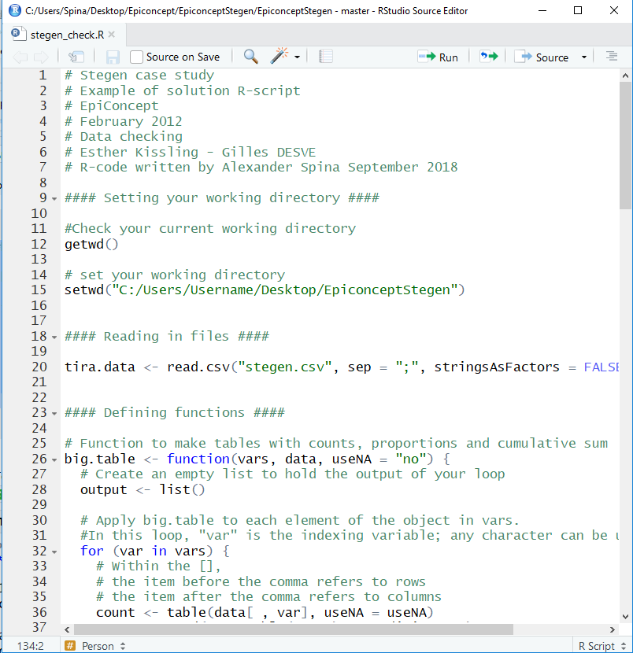
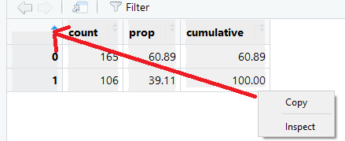

```{r setup, include=FALSE}
knitr::opts_chunk$set(echo = TRUE)
```


```{r, echo = F, warning= F, message= F}
#load packages
  #Those required for creating this markdown: 
    #"Worded": for styling and pagebreaks
    #"knitr": for styling tables
required_packages <- c("worded", "knitr") 

for (i in seq(along = required_packages)) {
  library(required_packages[i], character.only = TRUE)
}
```


<!---CHUNK_PAGEBREAK--->

# Copyright and License 

**Source:** 

This case study was first designed by Alain Moren and Gilles Desve, EPIET. It is based on an investigation conducted by Anja Hauri, RKI, Berlin, 1998


Minor revisions were brought to this case study by IntoEpi 2009,2010, Hong Kong 2016
It was then translated in to *R* by Alexander Spina in 2018. 

**Revisions:** 

*If you modify this case study, please indicate below your name and changes you made*  

**You are free:** 

- **to Share** — to copy, distribute and transmit the work 
- **to Remix** — to adapt the work 

**Under the following conditions:** 

- **Attribution** — 	You must attribute the work in the manner specified by the author or licensor (but not in any way that suggests that they endorse you or your use of the work). The best way to do this is to keep as it is the list of contributors: sources, authors and reviewers. 
- **Share Alike** — 	If you alter, transform, or build upon this work, you may distribute the resulting work only under the same or similar license to this one. Your changes must be documented. Under that condition, you are allowed to add your name to the list of contributors. 
- You cannot sell this work alone but you can use it as part of a teaching. 

**With the understanding that:** 

- **Waiver** — Any of the above conditions can be waived if you get permission from the copyright holder. 
- **Public Domain** — 	Where the work or any of its elements is in the public domain under applicable law, that status is in no way affected by the license. 
- **Other Rights** — In no way are any of the following rights affected by the license: 
  - Your fair dealing or fair use rights, or other applicable copyright exceptions and limitations; 
  - The author's moral rights; 
  - Rights other persons may have either in the work itself or in how the work is used, such as publicity or privacy rights. 
- **Notice** — 	For any reuse or distribution, you must make clear to others the license terms of this work by keeping together this work and the current license. 


This licence is based on http://creativecommons.org/licenses/by-sa/3.0/

<!---CHUNK_PAGEBREAK--->

# Objectives 

At the end of the case study, using *R* for stratified analysis and logistic regression, participants should be able to analyse data from a food borne outbreak investigation and to sort out the respective roles played by several food vehicles. 


<!---CHUNK_PAGEBREAK---> 

# Introduction 

## Session 1 

On 26 June 1998 the St Sebastian High School in Stegen, Germany, celebrated the graduation from school by organising a party to which 250 to 350 participants were expected. Attendants included graduates from St Sebastian High School, their families and friends, teachers, 12th grade students and some graduates from the nearby Marie-Curie school of Kirchzarten.  

A self service party buffet was supplied by a commercial caterer from Freiburg.
Food was prepared the day of the party and transported in a refrigerated van to the school.  

Festivities started with a dinner buffet open from 8.30 pm and followed by a dessert buffet offered from 10 pm. The party and the buffet extended late during the night and alcoholic beverages were quite popular. All agreed it was a party to be remembered. 


## The alert 

On 2nd July 1998, the Freiburg Health office of the Federal Council Office of Breisgau-Hochschwarzwald reported to the Robert Koch Institute (RKI) in Berlin the occurrence of many cases of gastroenteritis following the graduation party described above. More than 100 cases were suspected among participants and some of them were admitted to nearby hospitals. Sick people suffered from fever, nausea, diarrhoea and vomiting lasting for several days. Most believed that the tiramisu consumed at dinner was responsible for their illness.
Salmonella Enteritidis was isolated from 19 stool samples. 

The Freiburg health office sent a team to investigate the kitchen of the caterer. Food preparation procedures were reviewed. Food samples, except tiramisu (none was left over), were sent to the laboratory of Freiburg University. Microbiological analyses were performed on samples of the following: brown chocolate mousse, caramel cream, remoulade sauce, yoghurt dill sauce, and 10 raw eggs.  

The Freiburg health office requested help from the RKI in the investigation to assess the magnitude of the outbreak and identify potential vehicle(s) and risk factors for transmission in order to better control the outbreak.

Cases were defined as any person attending the party at St Sebastian High School who suffered from diarrhoea (>= 3 loose stool for 24 hours) between 27 June and 29 June 1998; or who suffered from at least three of the following symptoms: vomiting, fever>= 38.5 ° C, nausea, abdominal pain, headache.

Students from both schools attending the party were asked through phone interviews to provide names of persons who attended the party. 
Overall 291 responded to enquiries and 103 cases were identified (Attack rate = 35%). Among these cases, 84 received medical treatments and four were admitted to hospitals. Attack rates by age group were 36.6% for persons < 20 years, 32.1% for persons 20 to 29 years, and 36.8% for persons older than 29 years. 


## Q1. In order to prepare your analysis, summarise the above information and formulate hypotheses to be tested. (5 min discussion) 


<!---CHUNK_PAGEBREAK--->

The shape of the epidemic curve, the attendance to a single event (a buffet) pointed towards a food borne outbreak related to a point common source of infection.

Using the updated list of attendants, a retrospective cohort study including all attendants to the party (that could be reached) was conducted. All had received a standard questionnaire asking for demographic information, signs, symptoms and duration, admission to hospital, and food and beverages consumption at the party including amount consumed. Food specific attack rates were computed for more than 50 food items and beverages. 

## Q2. Establish a plan of analysis. (10 min discussion)


<!---CHUNK_PAGEBREAK--->

## Help task 2 

**Perform data cleaning** 

- For each variable, look at range, unexpected values, missing values. 
- Correct data using original forms if needed 

**Describe each variable** 

- For each variable, describe frequency distributions including missing values  and if needed means, median, modes, quartiles, SD, outliers 
- Make appropriate histograms and box plots 
- Choose relevant characteristics to describe the population 

**Identify the outbreak vehicle if any** 

- Chose the appropriate measure of association (RR, RD or OR) 
- Chose the appropriate statistical tests and appropriate level of confidence 
- Compute food specific attack rates 
- Look at proportion of cases exposed 
- Compute attributable risk % among exposed 
- Search for any dose response if appropriate 
- Interpret the results 

**Do a stratified analysis** 

- Identify the variables that are potential effect modifiers (EM) and confounders 
- Design appropriate stratification tables 
- Stratify on each level taken by the EM and confounders 
- Compute appropriate measurements to identify confounding and effect modification 
- Apply appropriate statistical tests 
- Interpret the results 

**Do a multivariable analysis** 

- Prepare the data set for the multivariable analysis 
- Identify numerical, nominal, discrete, continuous variables and decide how to analyse them 
- Create additional variables as needed (age groups, dummy variables, etc.) 
- Recode as necessary 
- Add variables one by one 
- Check for confounding and interaction 
- Select a final model 

## Q3. Check and clean the dataset “stegen.dta”. Create labels where appropriate.

Verify your working directory and open stegen.dta. The data set “stegen.dta” includes the following variables:


```{r, echo = F}

kable(read.csv("IntroTable.csv", sep = ";" , 
                    stringsAsFactors = FALSE ))

```


<!---CHUNK_PAGEBREAK---> 

## Help task 3 

Describe your dataset: frequency distributions, means, median, modes, quartiles, SD, outliers. 
Make appropriate histograms and box plots. 


### Setting your working directory

You can check the path for your current working directory using the *getwd* function.

```{r, eval = F}
#Check your current working directory
getwd()

```

To set your working directory you can use the *setwd* function. 

```{r, eval = F}

setwd("C:/Users/Username/Desktop/EpiconceptStegen")

```


### Reading in files

Import the dataset from a comma seperated value (.csv) file using the *read.csv* function, storing it as a dataframe within *R* called *tira.data*.For a CSV file the separator is normally a comma (","), however depending on the language of your operating system this can also be other values, for example a semi-colon (";"). Here we also specify that we do not want to read in string (character or grouped variables as factors).

```{r}
tira.data <- read.csv("stegen.csv", sep = ";", stringsAsFactors = FALSE )
```

### Describe your dataset 

For example: 

```{r, eval = F}

summary(tira.data) 
table(tira.data$sex)
table(tira.data$beer, useNA = "always") 
summary(tira.data$age) 
aggregate(tira.data$age, by = list(tira.data$sex), FUN = summary)
prop.table( table( tira.data$ill) )
```

*Example: ill* 

```{r, eval = F}

#get counts of ill 
  #save table as "counts"
counts <- table(tira.data$ill) 

#get proportions for counts table
prop.table(counts)

#you could also multiple by 100 and round to 2 digits
round(prop.table(counts)*100, digits = 2)

```

*Example: sex* 


```{r, eval = F}

#get counts 
  #save table as "counts"
counts <- table(tira.data$sex) 

#get proportions for counts table
prop.table(counts)

#you could also multiple by 100 and round to 2 digits
round(prop.table(counts)*100, digits = 2)

```

It is also possible to use a custom function to pull these various lines of code together in a custom function. You do not need to understand this code at current. You can run this code below which saves the *big.table* function in your environment; then you can use it the same way any other function works. 


```{r}
# Function to make tables with counts, proportions and cumulative sum
big.table <- function(vars, data, useNA = "always") {
  # Create an empty list to hold the output of your loop
  output <- list() 

  # Apply big.table to each element of the object in vars. 
    #In this loop, "var" is the indexing variable; any character can be used e.g. "i"
  for (var in vars) {
    # Within the [], 
      # the item before the comma refers to rows 
      # the item after the comma refers to columns
  count <- table(data[ , var], useNA = useNA)
  prop <- round(prop.table(count)*100, digits = 2)
  cumulative <- cumsum(prop)
  total <- t(rbind(count,
              prop,
              cumulative))
    # assign the value of your tables (total) to the output list 
      #(note: double square brackets "[[]]" are used to subset elements of a list)
    output[[var]] <- total
  }

output
    
}
  
  
```


You can now use this function as any other function. 

```{r}
# specify the variable in quotations and the dataset to use
big.table(var = "sex", data = tira.data)
```


*To show more than one table at a time:* 

We could use the big.table function to show more than one table at a time.

```{r, eval = F}

# specify multiple vars using c()
big.table(var = c("tira", "pork", "salmon"), data = tira.data)

```


*Describing continuous variable, example: age* 


```{r}
# use the aggregate function to group by sex
  # sex must be as a list
  # specify the function you would like to use (summary)
aggregate(tira.data$age, by = list(tira.data$sex), FUN = summary)

```


*Histograms*: 

A frequency plot is the default for *hist*. In order to plot each unique value of age on the x-axis, specify number of breaks (in this case 100 years); set the x-axis to match this.

```{r, eval = F}

# Plot a histogram of age
  # you can specify a bar for each age with "breaks"
  # you can set your x axis from 0-100 using "xlim"
hist(tira.data$age, 
  xlab = "Age",
  ylab = "Count", 
  breaks = 100,
  xlim = c(0, 100)
)

```


To have a nicer title: 
```{r}
# Plot a histogram of age
  # you can specify a bar for each age with "breaks"
  # you can set your x axis from 0-100 using "xlim"
  # main is where you set your title
hist(tira.data$age, 
  xlab = "Age",
  ylab = "Count", 
  breaks = 100,
  xlim = c(0, 100), 
  main = "Number of cases"
)

```


To save you can plot, then use *dev.copy* to choose a file type and name; *dev.off* closes the connection. 

```{r, eval = F}
# save histogram of age as a png file
dev.copy(png,'age.png')
dev.off()
```

If you believe that two age groups are identifiable you may want to create a new variable with two age classes (< 30 years and above). The following shows one way to do it:

```{r}
# create a binary variable for older than 30 years of age
tira.data$agegroup <- ifelse(tira.data$age >= 30, 1, 0 )

```

```{r, eval = F}
# check the age grouping 
table(tira.data$agegroup)
```

The *str* function will provide an overview of which variable types are in your dataset. The *summary* function will give minimum, maximum, first and third quartiles as well as medians and means for variables which are not strings (characters). Each of these commands can be run for individual variables also. You can refer to an individual variable of a data set by using the **$**, for example, if you wanted to obtain a summary of the a numeric age variable, then you would write **summary(tira.data\$age)**.  

```{r, eval=F}
# str provides an overview of the number of observations and variable types
str(tira.data$ill)

# summary provides mean, median and max values of your variables (where applicable NAs)
summary(tira.data$ill)

```

Codebook of the variables salmon, pork and horseradish show that a few records have the value 9. As in Q3 you are asked to clean these data, recode these values to missing.

```{r}
#for the rows where salmon is 9, overwrite with NA
tira.data$salmon[tira.data$salmon == 9] <- NA

#same for horseradish and pork
tira.data$horseradish[tira.data$horseradish == 9] <- NA
tira.data$pork[tira.data$pork == 9] <- NA

```


### Creating labels: 


In order to add labels in *R* you have to change variables in to factors. This allows you to specify levels (the order in which categories appear in output) and then label these levels. 

```{r}

#re-write the tira variable as a factor defining levels and labels
tira.data$tira <- factor(tira.data$tira, 
                     levels = c(1, 0), 
                     labels = c("Yes", "No")
                     )


#re-write the wmousse variable as a factor defining levels and labels
tira.data$wmousse <- factor(tira.data$wmousse, 
                     levels = c(1, 0), 
                     labels = c("Yes", "No")
                     )


#re-write the dmousse variable as a factor defining levels and labels
tira.data$dmousse <- factor(tira.data$dmousse, 
                     levels = c(1, 0), 
                     labels = c("Yes", "No")
                     )

```


You can label more than one variable at a time using a for-loop 

```{r}

#define the variables you would like to recode
vars  <- c("mousse", "beer", "redjelly", 
           "fruitsalad", "tomato", "mince", 
           "salmon", "horseradish", "chickenwin", 
           "roastbeef", "pork") 

#for each var defined in vars above
for (var in vars) {
  #select the column of tira.data in square brackets
    #overwrite with a factor as above
  tira.data[ , var] <- factor(tira.data[ , var], 
                     levels = c(1, 0), 
                     labels = c("Yes", "No")
                     )
}

```

And define different categories. 
```{r}

#define the variables you would like to recode
vars  <- c("tportion", "mportion") 

#for each var defined in vars above
for (var in vars) {
  #select the column of tira.data in square brackets
    #overwrite with a factor as above
  tira.data[ , var] <- factor(tira.data[ , var], 
                     levels = c(0, 1, 2, 3), 
                     labels = c("None", "One portion", 
                                "Two portions", "Three portions")
                     )
}

```


### R-scripts

You may also want to develop an R-script in which you will keep all relevant commands and annotate / comment each step of your analysis. 

You can select the "+" icon and select R-script from the dropdown (alternatively you could click File > New file > R-script) , insert your command and save with a specific “name.R”. An example is shown below:




You may want to create separate scripts for checking the dataset and for recoding the data (cleaning and creating labels).

<!---CHUNK_PAGEBREAK---> 


## Q4. Describe the outbreak in terms of person and time

Note: A “Place” variable is not available. Use the cleaned dataset stegen1.dta dataset.

<!---CHUNK_PAGEBREAK---> 


## Help task 4 

```{r, eval = F}
load("stegen1.Rda")
big.table("sex", tira.data)
summary(tira.data$age)
big.table("agegroup", tira.data) 
big.table("ill", tira.data) 
big.table("dateonset", tira.data[tira.data$ill == 1, ])

```

### Key tables for task 4: 
You can create these tables in Word or Excel from the data from the Stata output.

**Table 1.  Descriptive epidemiology: Study population by sex**
```{r, echo = F}
kable( matrix( c(
        "Sex",	"N",	"%",
        "Male",	"152",	"48",
        "Female",	"139",	"52",
        "Total",	"291",	"100"
), ncol = 3, byrow = T)
)
```
  

**Table 2.  Descriptive epidemiology: Study population by age group**
```{r, echo = F}
kable( matrix( c(
        "Age group", "N",	"%",
        "<30",	215,	74,
        "30+",	68,	23,
        "Missing",	8,	3,
        "Total",	291,	100
), ncol = 3, byrow = T)
)
```
    
**Mean age:** 26 years
**Median age:** 20 years
**Range:** 12 – 80 years
 
**Table 3.  Descriptive epidemiology: Attack rate**
```{r, echo = F}
kable( matrix( c(
        "Ill",	"N",	"%",
        "No",	188,	65,
        "Yes",	103,	35,
        "Total",	291,	100
), ncol = 3, byrow = T)
)
```
 
 
**Table 4.  Descriptive epidemiology: Cases by date of onset of illness**
```{r, echo = F}
kable( matrix( c(
        "Ill",	"N",	"%",
        "27 June 1998",	48,	47,
        "28 June 1998",	46,	45,
        "29 June 1998",	8,	8,
        "Missing",	1,	1,
        "Total",	103,	100
), ncol = 3, byrow = T)
)
```

### Copying tables in to Excel: 
To copy tables in to Excel, save your output as an object and can use the *View* function on your output data frame. Then highlight this from the bottom right to the top left, then copy and paste to Excel. 



Alternatively if you could use the *write.csv* function to creat a CSV file and open this with Excel. 

